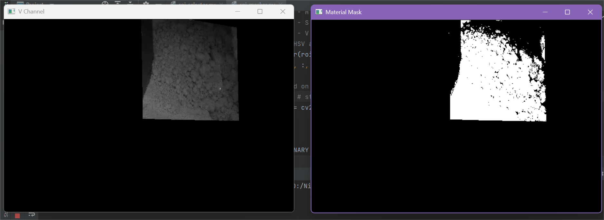

# Approach Evolution

## 1. Problem Understanding

The hopper is part of an industrial soap-manufacturing batch process. Material
prepared in an upstream mixer is discharged into the hopper and is then consumed
by the Noodler below it. Before a new batch can be dropped, two conditions must
be satisfied: the batch inside the mixer must have completed all its processing
steps, and the hopper must be sufficiently empty to receive the next batch.

Previously, the mixer batch was prepared automatically, but deciding when to
drop it depended on an operator. This created two recurring risks:

- A delayed drop could starve the downstream packing line of material.
- A premature drop could overload the hopper and contribute to material
  bridging, particularly when consecutive batches had different consistency.

An infrared level sensor was initially tested for hopper-empty detection, but
it could not be stabilised because the material did not descend as a uniform
level. It flowed unevenly and frequently remained on the hopper walls. The
existing fixed camera above the hopper was therefore repurposed to determine the
hopper-empty condition and provide a request signal to the mixer PLC.

The project evolved from a simple percentage estimate into a completed system
with dual-region vision, stuck-material compensation, PLC sequencing,
time-of-day calibration, live configuration, fault handling, and an operator
dashboard.


## 2. Colour Space Analysis (HSV V Channel)

The first vision task was to separate material from the metal hopper. The
material appears visibly brighter than the hopper walls in the installed camera
view, so brightness offered a direct and explainable way to distinguish the two.

Initial grayscale experiments were sensitive to lighting and camera-exposure
changes. The HSV colour space was therefore evaluated:

- Hue did not consistently separate materials of different colour.
- Saturation was also inconsistent across products and illumination.
- The Value (V) channel represented brightness and gave the clearest contrast
  between the brighter material and the darker hopper walls.

The camera frame is converted from BGR to HSV and the V channel is extracted. A
binary brightness threshold then classifies pixels as material or background.
Morphological opening and closing remove small points of noise and fill minor
gaps, producing a stable material mask for percentage calculation.





## 3. Percentage-Based Material Estimation

Once a binary material mask was available, the first hopper-empty method was to
measure how much of the selected hopper area was occupied by white pixels:

```text
material percentage = material pixels / ROI pixels x 100
```

This converted a changing camera image into a simple material-level indicator.
A percentage threshold represented the point at which the hopper could be
considered empty. The condition also had to remain active for a fixed duration,
preventing brief shadows, falling pieces, or momentary gaps from creating a
false trigger.

This baseline worked when the material fell cleanly, but it counted every bright
material pixel equally. Material that was no longer flowing could therefore
continue to increase the estimated level.


## 4. Residual Material on Hopper Walls

Production videos showed that a noticeable amount of material could remain
attached to the side walls or internal ledges after the main bulk had moved
downward. This material was still visible as white pixels, even though it was no
longer part of the usable flowing mass.

If all of these pixels were included, the calculated material percentage stayed
above the empty threshold for too long. The intended automatic batch drop would
then be delayed, recreating one of the problems the system was designed to
remove.


## 5. Persistence-Based Subtraction of Detached Material

An early solution attempted to identify separate blobs and track each blob's
centroid and area. A blob that did not move while the Noodler was operating was
treated as stuck material. In practice, small changes in the binary mask caused
blobs to split, merge, receive new labels, and shift their centroids. Geometric
tracking was therefore too unstable for dependable production use.

The final approach replaced blob identity tracking with pixel persistence:

1. Connected-component analysis identifies the largest visible component as the
   main material mass.
2. Other white pixels are treated as detached material.
3. A persistence counter is maintained for every detached pixel.
4. A counter increases while that pixel remains detached and white, and resets
   immediately if it disappears or rejoins the main mass.
5. Pixels that persist for the configured duration are classified as stuck.
6. Very small stuck regions are rejected as noise.
7. Confirmed stuck pixels are subtracted from the primary material count.

In `video_player_3.py`, detached pixels currently have to persist for four
seconds, and stuck regions smaller than 30 pixels are ignored. The effective
primary percentage is calculated from the remaining flowing material:

```text
effective material = total material pixels - confirmed stuck pixels
```

This method is more stable because it asks whether material remains in the same
image locations, rather than attempting to maintain a fragile identity for each
changing blob.


## 6. ROI Selector and the Role of the Secondary ROI

The application uses two independent Regions of Interest (ROIs). Running
`roi_selector.py` opens two windows containing the complete live camera feed:

- The left window is used to draw the **primary ROI** over the upper/main hopper
  area where the bulk material level is observed.
- The right window is used to draw the **secondary ROI**, a small square or
  polygon placed precisely over the hopper mouth. When the mouth is clear, this
  region exposes the worms of the Noodler below.

In each window, left-click adds polygon points and right-click saves the ROI.
Both polygons are written to `config/roi.json`. Existing coordinates are loaded
when the selector starts, and the running detector reloads the file
automatically if it is changed.


### Why the secondary ROI was required

Primary-ROI persistence can subtract material only after it becomes visually
detached from the largest material component. A production edge case showed why
that was not always sufficient.

In `data/mixer 01 131125/Sample Video 6_demo.mp4`, material remains near the
mouth of the hopper while still appearing connected to the main mass in the
camera image. Because it is not a separate component, the primary persistence
logic cannot classify and subtract it as detached material, even when the mouth
has become sufficiently clear for the process to continue.

The secondary ROI solves this by looking only at the discharge mouth. It does
not apply the primary stuck-material subtraction. Instead, it independently
measures the bright-pixel percentage in the small flow area. The worms of the
Noodler become visible as the mouth clears, reducing the material percentage in
this ROI.

The two empty detectors are combined with an OR condition:

- **Primary empty:** effective primary material is below 18% continuously for
  eight seconds.
- **Secondary empty:** secondary material is below 60% continuously for four
  seconds.
- **Vision empty:** primary empty OR secondary empty.

If both detectors are active, the recorded trigger cause is `BOTH`; otherwise it
is recorded as `PRIMARY` or `SECONDARY`.


## 7. State Logic

The final program uses an explicit state machine so that one empty indication
cannot repeatedly trigger the mixer gate. The camera provides a request to the
PLC, while the PLC retains control of the actual machine sequence and its
interlocks.

### READY

The system continuously evaluates both ROIs and polls the gate feedback every
0.5 seconds. The installed PLC feedback is `1` when the gate is closed and `0`
when it is open; the code converts this into an internal `gate_open` value.

When `vision_empty` becomes true and the gate is confirmed closed, Python writes
the camera request bit to the PLC. It also records the trigger cause and saves a
camera snapshot and annotated material-mask image.

The request bit is used in the PLC ladder in series with the existing process
conditions. These include completion of the mixer batch sequence (mixer step
zero), Auto Mode selected from SCADA, and the other machine permissives. Python
does not bypass these interlocks and does not directly open the gate.

### WAIT_GATE_OPEN

After sending the request, the program waits for the PLC-controlled gate-open
feedback. When the PLC permissives are satisfied, the PLC opens the gate and the
feedback changes from closed to open. The program records the gate-open time and
moves to the trigger-reset state.

### WAIT_TRIGGER_RESET

The camera request remains on for eight seconds after gate-open feedback. It is
then written off. Turning off the request does not command an immediate gate
close; it only completes the Python side of the handshake.

### WAIT_GATE_CLOSE

The mixer PLC completes its established discharge cycle: the gate remains open,
the mixer runs, waits for approximately 45 seconds, stops, closes the gate, and
then advances to the first step of the next batch. During this sequence, Python
simply waits for gate-closed feedback and does not interfere with PLC timing.

### WAIT_REARM

After the gate has closed, the system waits for clear evidence that the new
batch has refilled the hopper. In the current implementation, the effective
primary material percentage must remain above 35% continuously for 30 seconds.
If it falls below 35% during that interval, the timer resets.

Only after this refill confirmation are the previous trigger cause, gate state,
and timers cleared and the state returned to `READY`. This sequence prevents
retriggering during a gate cycle or during an incomplete refill.

### Fail-safe request handling

The PLC request can be switched ON only from `READY`, after a time-confirmed
vision-empty condition and closed-gate feedback. Once requested, Python remains
in `WAIT_GATE_OPEN` regardless of whether the PLC gate is subsequently operated
through Manual or Auto Mode; SCADA mode selection is intentionally not part of
the Python state machine.

Stop, Exit, PLC errors, unexpected exceptions, and general shutdown paths all
attempt to write the PLC request OFF before closing the connection. If the
camera reaches its confirmed frame-loss limit while the request is active, the
application also attempts the OFF write, enters `FAULT`, and stops that detector
run instead of reconnecting with an active request. If PLC communication itself
is unavailable, delivery of the OFF write cannot be guaranteed and must remain
protected by the PLC-side controls and interlocks.


## 8. Time- and Brightness-Based Thresholding

The binary classifier depends on the brightness contrast between material and
the hopper. Natural light entering the hopper changes throughout the day, so one
fixed V-channel threshold did not give equally stable segmentation under every
lighting condition.

`video_player_3.py` selects a brightness threshold from the current system hour
on every processing cycle:

| Time period | V-channel threshold |
|---|---:|
| 06:00 to 10:59 | Morning: 92 |
| 11:00 to 15:59 | Afternoon: 98 |
| 16:00 to 18:59 | Morning/evening: 92 |
| 19:00 to 05:59 | Night: 90 |

The afternoon value is higher because stronger incoming light makes more pixels
appear bright. The night value is lower so that material remains detectable
under reduced illumination. These values are stored in `config/settings.json`
and can be updated through the dashboard without editing the vision code.

It is important to distinguish the two kinds of thresholds:

- The **brightness threshold** decides whether an individual pixel represents
  material.
- The **percentage threshold** decides whether enough material remains in an
  ROI to consider the hopper non-empty.


## 9. Dashboard

For routine operator use, `dashboard.py` provides a full-screen Autobatching
Console instead of requiring the operator to run Python scripts manually.

The dashboard displays two live panels supplied by `video_player_3.py`:

- The processed V-channel image.
- The annotated material mask, including primary material percentage,
  secondary percentage, active brightness threshold, trigger cause,
  vision-empty status, gate status, PLC-trigger status, and current state.

The available controls are:

- **START:** runs the integrated `video_player_3.py` detection and PLC logic in
  a background thread.
- **STOP:** requests an orderly stop and releases the camera and PLC resources.
- **ROI SELECTOR:** opens the two-window live ROI tool if maintenance or camera
  movement has changed the framing.
- **APPLY SETTINGS:** validates and saves the editable thresholds.
- **EXIT:** closes the console and requests clean worker shutdown.

The operator can edit five values directly from the console:

- Morning/evening brightness threshold
- Afternoon brightness threshold
- Night brightness threshold
- Primary empty percentage
- Secondary empty percentage

The values are saved to `config/settings.json`, reloaded by the application, and
retained after a restart. This lets authorised operators or engineers recalibrate
the vision system without modifying source code.


## 10. Final Running System

The completed solution is represented by three main files:

- `hopper_empty_final.py` retains the final standalone computer-vision logic
  without PLC control.
- `video_player_3.py` is the integrated production implementation containing
  vision, PLC handshake, state logic, camera recovery, live status, and image
  logging.
- `dashboard.py`, supported by `settings.py`, provides the operator-facing
  control and calibration interface.

During operation, the system:

1. Reads the live camera stream and selects the time-appropriate brightness
   threshold.
2. Processes the primary and secondary ROIs independently.
3. Removes persistent detached material from the primary estimate.
4. Confirms primary or secondary empty conditions for their respective times.
5. Sends one PLC request and follows the gate-feedback state sequence.
6. Waits for a confirmed refill before returning to `READY`.
7. Updates the dashboard continuously.
8. Reloads changed ROI coordinates without restarting detection.
9. Attempts to reconnect after camera frame loss.
10. Saves trigger snapshots, annotated overlays, and hourly diagnostic images.

The system was tuned using production footage covering different batches,
material behaviour, lighting periods, and camera conditions. The final code is
running successfully in the factory as a closed-loop hopper-empty and automatic
batch-drop solution.


