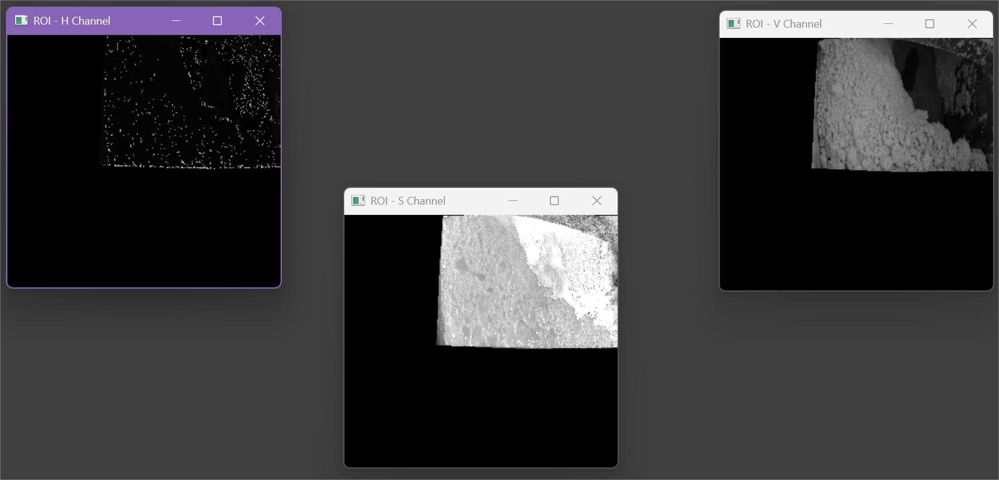

# Approach Evolution

## 1. Problem Understanding

The hopper under consideration is part of a batching process in industrial soap manufacturing setup. Material from an upstream mixer is discharged into the hopper and subsequently consumed by downstream equipment. For correct batch sequencing, two conditions must be satisfied before dumping a new batch: the batch preparation in the mixer must be complete, and the hopper must be nearly empty.
Currently, while the batchmaking is automated, the dumping and restarting of batch is a manual process. This manual dependency leads to two issues:
- Delay in batch dump leading to shortage of material on the packing line downstream
- Premature dumping of the next batch, causing material bridging inside the hopper, especially when consecutive batches have different material consistency

To address this, an auto-batching system was initially implemented using an infrared level sensor to detect hopper empty conditions and trigger the mixer gate. However, this approach could not be stabilized due to non-uniform material flow and uneven hopper emptying behavior.
Therefore, a computer vision based system was evaluated. The footage from an existing camera on the hopper has been repurposed to detect the "Hopper empty" condition and give trigger to the mixer PLC to open the gate.

## 2. ROI-Based Material Isolation

The first design decision was to restrict all image processing to a well-defined Region of Interest (ROI) corresponding to the hopper interior.

Key considerations:
- Larger background introduces more noise and variability
- Dont need to see the entire hopper in frame as aim is not continuous level detection but low level identification
- The hopper geometry is fixed, making a static ROI viable

A manual ROI selection tool was implemented to allow accurate polygon selection during setup. All subsequent image processing is performed only within this ROI, ensuring consistency across different lighting conditions and camera framing.

## 3. Color Space Analysis (HSV / V Channel)

Initial experiments with grayscale thresholding showed sensitivity to lighting changes and camera exposure adjustments.

To improve robustness, the HSV color space was evaluated. It was observed that:
- The Hue and Saturation channels were not effective in bifurcation of material and hopper
- The Value (V) channel provided the strongest contrast 

As a result, the V channel was selected for segmentation. Binary thresholding on the V channel, followed by morphological cleanup, produced a stable material mask across different operating conditions.

## 4. Percentage-Based Hopper Empty Detection

Using the segmented material mask, a simple baseline approach was implemented:

- Compute the percentage of white pixels within the ROI
- Declare the hopper empty when this percentage falls below a defined threshold for a fixed duration

Morphological cleaning was applied to the binary mask to suppress noise before percentage calculation.
This approach works well under ideal conditions and provided a useful baseline for further development. A time-based confirmation window was added to avoid transient false triggers due to momentary flow fluctuations.

## 5. Failure Mode: Residual Material on Hopper Walls

During testing the percentage based approach on multiple batches, a consistent failure mode was observed.
While the main bulk of material had already reduced, **sometimes mall but visually significant quantities of material remained adhered to the hopper side walls and internal ledges**.
Although this residual material was no longer participating in the flow, it continued to appear as white pixels within the ROI and hence the empty threhsold crossing was delayed. This could potentially lead to batch delays again.

## 6. Early Attempts: Blob Separation and Geometrical logic

To address this issue, a mechanical causality was factored in. Any material that has been separated from the main moving mass was a blob and if it remained constant in a location while it was supposed to move, it was **subtracted from total white pixels count**

Connected component analysis was introduced and the following logic was applied:
- Identify all connected materials and mark the section was classified as main material and all other smaller sections were considered as blobs
- Each such blob was given an id and its centroid and area was tracked over time
- If the blob's centroid did not change while Noodler (the machine below the hopper) was running, its pixels were subtracted from total white pixels count

The method was not very successful due to the following reasons:
- Flickering in the binary mask caused the centroid to shift very frequently
- As a result, blobs were continously splitting and were being relabeled, making the logic unstable

## 7. Persistence Based Subtraction of Detached Material

Two major conceptual changes were brought in to resolve this issue and stabilize the blob elimination process:
- Once a small part of the material has been separated, it is not really dependent on the noodler's running state
- Rather than depending on geometrical concepts like centroid and area, add up the white pixels which have been separated and stay white for some amount of time

A per pixel persistence map was created and maintained where:
- Detached pixels increment a persistence counter each frame
- Pixels that fall off and rejoin the main bulk are immediately reset
- Pixels exceeding a time-based persistence threshold are classified as stuck material

Once a stuck material has been identified, its pixels were subtracted from total white pixels count. Visualization of white pixels and subtracted pixels count was also introduced into the masked window to validate the effectiveness of this method. 

## 8. Final Stable Design Summary

The final solution integrates the following principles:
- User based ROI identification for scalability and negating practical challenges
- HSV V-channel segmentation for robustness against lighting conditions and varying material colour 
- Morphological cleaning for noise suppression and Binary Thresholding for clear bifurcation
- Largest connected component identification for main material and blobs identification
- Persistence based subtraction of blobs from white pixels count
- Time confirmed white pixels percentage threshold for hopper empty detection

The system has been validated across multiple operating conditions, camera framings, and batch behaviors.  
Parameter values were tuned empirically using a large set of real production videos to ensure stability.

This design provides a reliable, explainable, and plant-deployable solution for hopper empty detection, suitable for closed-loop integration with PLC-based batch control systems.
